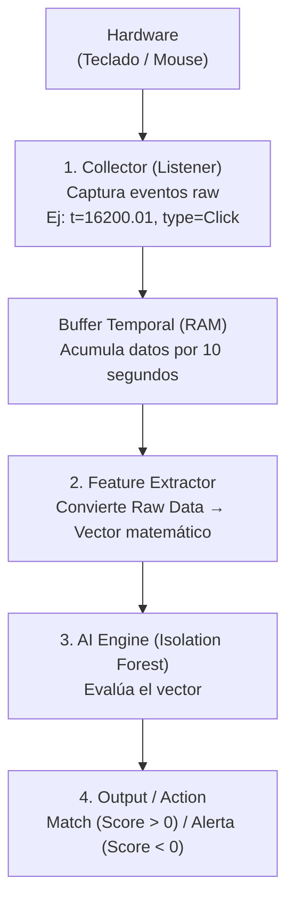

# 📘 Documentación Técnica: ShadowPrint AI
**Versión:** 1.0.0 (MVP)  
**Tecnología:** Python, Scikit-Learn, Pynput  
**Concepto:** Autenticación Continua por Biometría Conductual

---

## 1. 🌐 Visión General del Proyecto

**ShadowPrint AI** es un sistema de seguridad pasiva (Zero Interaction Authentication). A diferencia de las contraseñas que se ingresan una vez, ShadowPrint verifica la identidad del usuario **continuamente** analizando *cómo* interactúa con los periféricos.

### Filosofía de Diseño
1.  **Privacidad por Defecto:** No se registran caracteres (Keylogger) ni capturas de pantalla. Solo se analizan intervalos de tiempo y vectores de movimiento.
2.  **Detección de Anomalías:** El sistema no busca "quién es esta persona", sino "¿es esta persona quien dice ser?". Si el comportamiento se desvía del patrón entrenado, se marca como anomalía.
3.  **Tiempo Real:** El procesamiento se realiza en ventanas temporales cortas (ej. 10 segundos) para ofrecer respuestas inmediatas.

---

## 2. 🏗️ Arquitectura del Sistema

El flujo de datos sigue una tubería (pipeline) de procesamiento secuencial:




---

## 3. 📂 Estructura Detallada de Archivos

### `src/collector.py` (Módulo de Adquisición)
Es el "oído" del sistema. Utiliza `pynput` para engancharse a los drivers del sistema operativo.

*   **Clase `DataCollector`**:
    *   **Threading**: Se ejecuta en hilos separados para no bloquear la ejecución principal.
    *   **Locks**: Usa `threading.Lock()` para evitar "Race Conditions" cuando el hilo principal intenta leer el buffer mientras el hilo de captura intenta escribir en él.
    *   **Privacidad**: En el método `_on_key_press`, la variable `key` (que contiene la letra) **se ignora deliberadamente**. Solo se guarda `time.time()`.

### `src/features.py` (Ingeniería de Características)
Aquí es donde ocurre la transformación de datos crudos a biometría. Convierte una lista de eventos en una "Firma Digital" (un array de números).

**Las Métricas Calculadas:**
1.  **Velocidad de Tipeo (K-Avg):** Promedio de tiempo entre teclas. Un usuario rápido tendrá valores bajos (ej. 0.1s), uno lento altos (0.3s).
2.  **Ritmo/Consistencia (K-Std):** La desviación estándar del tipeo. ¿El usuario escribe como metrónomo (robótico) o tiene pausas irregulares (humano)?
3.  **Velocidad del Mouse (M-Avg):** Píxeles por segundo promedio.
4.  **Aceleración/Explosividad (M-Std):** Variación en la velocidad del mouse.
5.  **Micro-Tremor / Jitter (M-Ang-Std):**
    *   Se calcula el ángulo de movimiento (arcotangente) entre puntos.
    *   Se mide la desviación estándar de esos ángulos.
    *   *Significado:* Un movimiento humano suave tiene baja desviación angular en trazos rectos. Un bot o un usuario nervioso/diferente tendrá "ruido" angular distinto.

### `src/model.py` (El Cerebro - Isolation Forest)
Utilizamos **Isolation Forest** (Bosque de Aislamiento).

*   **¿Por qué este algoritmo?**
    *   Es un algoritmo de **Aprendizaje No Supervisado**.
    *   No necesitamos datos de "hackers" para entrenarlo. Solo necesitamos datos del "Dueño".
    *   El algoritmo asume que los datos del dueño son "normales" y están agrupados. Cualquier dato nuevo que caiga "lejos" de ese grupo en el espacio vectorial es considerado una anomalía.
*   **Hiperparámetro Clave: `contamination`**:
    *   Define qué tan estricto es el modelo.
    *   `0.01`: Muy tolerante (difícil disparar alerta).
    *   `0.10`: Muy estricto (puede generar falsos positivos si cambias de postura).

### `main.py` (Orquestador)
Controla el ciclo de vida de la aplicación.
1.  **Modo `record`**: Llena un CSV. No hay IA aquí, solo recolección.
2.  **Modo `train`**: Lee el CSV, entrena el Isolation Forest y guarda un archivo binario (`.pkl`).
3.  **Modo `watch`**: Carga el `.pkl`, inicia el Collector y en un bucle infinito `while True` consulta al modelo cada X segundos.

---

## 4. 📊 Diccionario de Datos

### Archivo: `data/raw_behavior.csv`
Este archivo se genera durante la grabación. Cada fila es una ventana de tiempo (ej. 10 segundos de uso).

| Columna | Tipo | Descripción |
| :--- | :--- | :--- |
| `k_avg` | Float | Tiempo medio (segundos) entre pulsaciones de teclas. |
| `k_std` | Float | Variabilidad del ritmo de escritura. |
| `m_avg` | Float | Velocidad media del puntero del mouse. |
| `m_std` | Float | Variabilidad de la velocidad del mouse. |
| `m_ang_std` | Float | "Suavidad" del trazo (Varianza angular). |
| `activity` | Int | Cantidad total de eventos en esa ventana (intensidad de uso). |

---

## 5. 🛠️ Guía de Configuración y Ajuste Fino (Tuning)

Si el sistema no funciona como esperas (muchas falsas alarmas o no detecta intrusos), ajusta estas variables:

### A. Ventana de Tiempo
En `main.py`, busca `time.sleep(10)` o `time.sleep(8)`.
*   **Menos tiempo (ej. 5s):** Detección más rápida, pero menos precisa (el vector estadístico es inestable con pocos datos).
*   **Más tiempo (ej. 20s):** Detección muy precisa, pero el intruso tiene 20 segundos para actuar antes de la alerta.
*   *Recomendado:* 10 a 15 segundos.

### B. Sensibilidad del Modelo
En `src/model.py`:
```python
self.model = IsolationForest(..., contamination=0.05)
```
*   **Subir a `0.1` o `0.15`**: El sistema se vuelve paranoico. Útil para entornos de alta seguridad. Te bloqueará si estás cansado o usas el mouse con la otra mano.
*   **Bajar a `0.01` o `0.005`**: El sistema es permisivo. Solo detectará bots obvios o personas muy diferentes a ti.

---

## 6. 🔒 Consideraciones de Seguridad y Ética

### Privacidad del Usuario
Es vital documentar que **ShadowPrint AI no es un Spyware**.
*   **Prueba de Código:** En `collector.py`, la línea `self.events.append({...})` no incluye `key.char`.
*   **Datos Derivados:** El archivo CSV final solo contiene estadísticas abstractas. Es imposible reconstruir qué escribió el usuario (ingeniería inversa imposible) a partir de `k_avg: 0.12`.

### Limitaciones de Seguridad
*   **Replay Attacks:** Si un atacante graba las señales USB exactas y las reproduce con un hardware especializado, podría engañar al sistema (aunque es muy complejo sincronizar los micro-tiempos).
*   **Falsos Positivos:** Cambios de hardware (cambiar de mouse pesado a uno ligero) o lesiones físicas en el usuario alterarán la huella y requerirán re-entrenamiento.

---

## 7. 🚀 Hoja de Ruta (Roadmap) para Evolucionar el Proyecto

Para llevar este MVP a un producto profesional, estos son los siguientes pasos sugeridos:

### Fase 2: Robustez (Feature Engineering Avanzado)
*   **Digraphs & Trigraphs:** Medir tiempos específicos entre pares comunes (ej. tiempo entre 'C' y 'trl', o 'E' y 'nter').
*   **Mouse Trajectory Analysis:** Usar curvatura del movimiento. Los humanos hacen arcos, los bots hacen líneas rectas.

### Fase 3: Infraestructura
*   **API Rest con FastAPI:** Separar el Collector (Cliente) del Modelo (Servidor). El cliente envía vectores, el servidor responde "OK" o "BLOCK".
*   **Base de Datos:** Migrar de CSV a SQLite/PostgreSQL para manejar múltiples usuarios.

### Fase 4: Respuesta Activa
*   Integrar con el sistema operativo para bloquear la pantalla (`ctypes.windll.user32.LockWorkStation()` en Windows) automáticamente cuando `Score < -0.5`.
